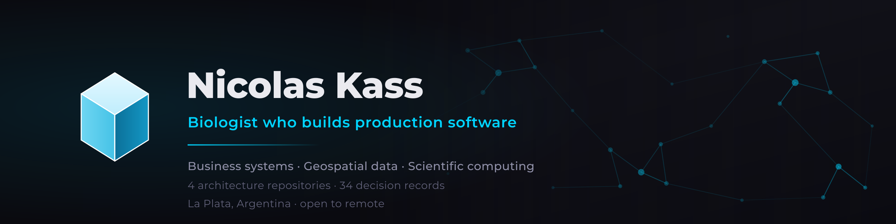

I build the operational systems small businesses actually run on — inventory, point of
sale, invoicing, field tooling — and the data pipelines behind them. Backend, frontend,
deployment and the operation itself, because for most of my career there was nobody else
to hand it to.

I came to software from field biology, and that is the least interesting and most useful
thing about me. It is where I learned that a number needs a defence.

---

## What I have published

Four repositories. **No client source code** — what is documented is the reasoning: what I
decided, what I rejected, and what each decision cost.

| Repository | What it is | What it shows |
|---|---|---|
| **[specialty-retail-erp](https://github.com/nicolaskass/specialty-retail-erp)** | A production ERP: 13 modules, 84 models, 229 routes, ~190k LOC | System architecture, bounded contexts, a large consolidation refactor over live financial data |
| **[geospatial-survey-toolkit](https://github.com/nicolaskass/geospatial-survey-toolkit)** | Field tooling for a surveying practice | Delivering software to non-technical users, and letting the expert — not the tool — decide |
| **[geospatial-data-processing](https://github.com/nicolaskass/geospatial-data-processing)** | LiDAR and photogrammetry pipeline, plus a reference book in progress | Measurement discipline: validation that is not circular, uncertainty that reaches the deliverable |
| **[ecological-data-analysis](https://github.com/nicolaskass/ecological-data-analysis)** | The statistics behind four manuscripts, with published reproducibility packages | Bayesian inference, prior sensitivity, simulating my own estimator's bias |

**34 architecture decision records** between them. Each one states what the decision cost,
not only what it bought — including the cases where I would choose differently for a
different problem.

---

## How I work

The parts that are not standard, and that the repositories document in detail:

**I make drift impossible instead of promising to prevent it.** A post-commit hook that
flags documentation gone stale against the code. A checker that verifies every citation
from code to manuscript still resolves. A generated JSON that a paper reads its numbers
from, so text and tables cannot disagree. Three domains, three times the same conclusion:
**anything maintained by intention decays — bind it mechanically.**

**I meter what I spend.** Every LLM call in production writes tokens, latency and cost to
a usage log priced from a maintained table, so cost per feature is a query rather than a
surprise at the end of the month. Inference is a purchase; systems meter what they buy.

**I design what happens when a dependency is gone.** Optional integrations degrade instead
of failing. One third-party integration has sat broken in production for months, by
design, with no user-visible failure.

**I write down what a decision cost.** Every record has a section for its downsides. A
document that only lists benefits is marketing, and it makes the rest of the document less
believable.

**I know where automation should stop.** In the surveying tools, the software flags
anomalies and refuses to correct them, because field measurements are evidence and the
surveyor is the one qualified to judge. Automating a judgement is only safe when being
wrong is cheap.

---

## Where the rigour comes from

Validating against data held out of fitting. Propagating measurement error into anything
derived from it. Separating precision from accuracy. Refusing to report a figure without
its uncertainty.

These are ordinary obligations in field ecology, where a population estimate without a
confidence interval does not get published and a method that was never validated against
independent data does not get believed.

They are not yet ordinary in commercial software, or in commercial surveying — and the
transfer required no new technical knowledge at all. Only the reflex to ask, of any number:
**compared to what, and how sure are we?**

I am finishing a PhD in Natural Sciences at UNLP (conservation of Patagonian amphibians), I
teach at university, and I am an ISO 9001 consultant. Those are not a parallel career. They
are why the software looks the way it does.

---

## Now

Founder of [T³](https://t3.com.ar), where I do process consulting and build systems for
small businesses. Based in La Plata, Argentina; working remotely without difficulty.

Open to engineering roles, consulting engagements, and the right co-founder conversation.

**[Full CV →](https://nicolaskass.github.io)** · English and Spanish, PDF included
&nbsp;&nbsp;·&nbsp;&nbsp; [LinkedIn](https://www.linkedin.com/in/nicolaskass)
&nbsp;·&nbsp; [ResearchGate](https://www.researchgate.net/profile/Nicolas_Kass)
&nbsp;·&nbsp; [t3.com.ar](https://t3.com.ar)

Every figure quoted above is a real measurement taken from the projects — lines,
modules and records counted from the source, not estimated.
